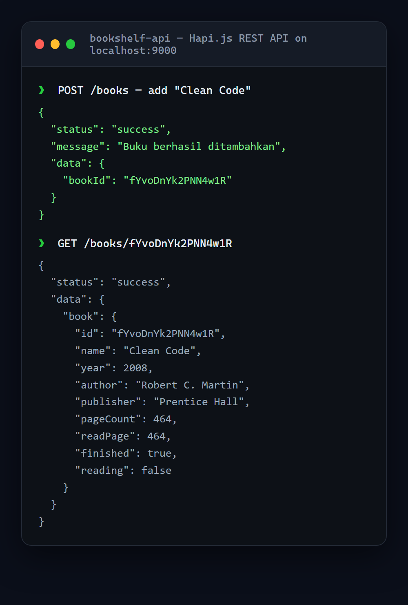

# Bookshelf REST API

A RESTful API for managing a book collection — full **CRUD** with input validation — built on **Hapi.js**.

<p align="center">
  
</p>

## Endpoints

| Method | Path | Description |
|---|---|---|
| `POST` | `/books` | Add a new book |
| `GET` | `/books` | List all books (supports `?name`, `?reading`, `?finished` filters) |
| `GET` | `/books/{bookId}` | Get one book by id |
| `PUT` | `/books/{bookId}` | Update a book |
| `DELETE` | `/books/{bookId}` | Delete a book |

## Highlights

- **Validation** — rejects requests with a missing `name` or with `readPage > pageCount`, returning the correct `400` status and message.
- **Derived state** — `finished` is computed automatically from `pageCount` and `readPage`.
- Unique IDs via `nanoid`; timestamps on every record.
- A Postman collection (`BookshelfAPITestCollectionAndEnvironment/`) is included for testing.

## Run it

```bash
cd bookshelf-api
npm install
npm start          # server runs on http://localhost:9000
```

## Tech stack

Node.js · Hapi.js · nanoid

## Notes

Back-end submission for Dicoding's *Belajar Membuat Aplikasi Back-End untuk Pemula dengan JavaScript*.
